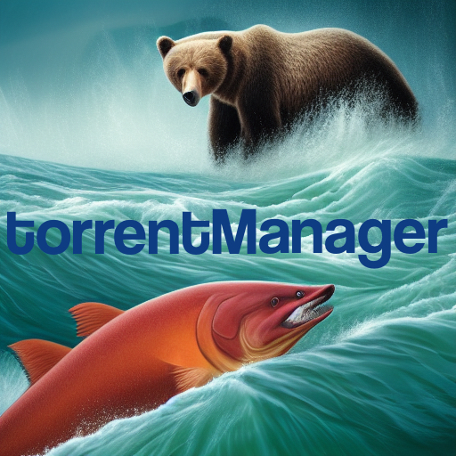

<div align="center">
  <figure>
    
    <br>
    <figcaption>The manager of the torrent is the bear 🐻, got it? 🥹</figcaption>
  </figure>

  # torrentManager  
  🦄 Automagically 🪄 manage your qBittorent client.
    
  [](https://ko-fi.com/F1F7ABOVF)

  [](https://github.com/tatoalo/torrentManager) [][hub] [][hub]

[hub]: https://hub.docker.com/r/tatoalo/torrent-manager/
</div>

torrentManager can be used to automatically perform operations like: 
* stop seeding process once download of a specific tag or category has completed
* remove torrents (metadata & files) of a specific tag or category group
* attach a specific TAG to specific torrents (e.g. *private trackers*) 

The core has been developed in a quick and easy manner, on purpose to be easily extendible, using the very well documented qBittorrent API.

I am using a simple polling strategy and a local persistent key-value storage mechanism, both of this choices can be easily tweaked or swapped with different components and choices really easily.

### Docker

The container expects to load the [configuration file](#configuration) from `/config/configuration.toml` so mount a volume accordingly.

```
$ docker run -itd \
             --rm \
             -v /path/to/my/configuration/file:/config/file \
             tatoalo/torrent-manager
```

#### Docker Compose

```yaml
version: '3.8'
services:
  torrentmanager:
    image: tatoalo/torrent-manager
    restart: unless-stopped
    volumes:
      - /path/to/my/configuration/file:/config/file
```

### Configuration

The configuration file allows the authentication mechanism towards the qBittorrent instance, download/upload limits, interested categories and their respective save paths (**NOT** all sections are mandatory).

```toml
[qbt]
host = "host"
port = 6942
username = "username"
password = "password"

# B/s
[qbt_config]
dl_limit = -1
up_limit = -1

[qbt_categories]
categories = ["cat", "cat2"]

[targets]
dir_targets = { "cat" = "path", "cat2" = "path" }

[trackers]
trackers_tags = { "tracker_endpoint" = "tag" }
```

#### Custom Scheduling

The default scheduling mechanism is stored in `torrent-manager-cron`, although a custom schedule can be introduced in one of two ways:

- Edit `torrent-manager-cron` accordingly and rebuild the image
- Edit the environment variables directly in the `docker run` command or `docker compose` file, namely.
It is possible to just customize a single mechanism (`launcher` or `cleaner`) or even both in the same context, these are the env variables:
  - `LAUNCHER_CRON` for when the main launcher is executed
  - `CLEANER_CRON` for when the cleaning mechanism is executed

Both variables are to be assigned a `cron`-valid schedule pattern.

#### Monitoring

Another couple of environment variables can be set in order to monitor the health of the cron jobs, namely:

- `HC_UUID_LAUNCHER`
- `HC_UUID_CLEANER`

Their value must be an `healthchecks`-compatible `uuid` (or `slug`).
I've been a fan of [cronitor](https://cronitor.io/) but [healtchecks](https://healthchecks.io/)'s free offering is more convenient in my opinion.

Similarly to the [Custom Scheduling](#custom-scheduling), both environment variables can be set at the same time, you can decide to activate only one or not have monitoring in place at all, up to you :)

#### Tagging Private Trackers

In the `configuration.toml` file, a section `trackers` can be specified such as:

```toml
[trackers]
trackers_tags = { "tracker_endpoint" = "tag" }
```

so that if a torrent is found to possess a tracker like `tracker.tracker_endpoint.forreal`, it will be tagged with `tag`.

## License

    Copyright 2022 Alessandro Pogliaghi

    Licensed under the Apache License, Version 2.0 (the "License");
    you may not use this file except in compliance with the License.
    You may obtain a copy of the License at

       http://www.apache.org/licenses/LICENSE-2.0

    Unless required by applicable law or agreed to in writing, software
    distributed under the License is distributed on an "AS IS" BASIS,
    WITHOUT WARRANTIES OR CONDITIONS OF ANY KIND, either express or implied.
    See the License for the specific language governing permissions and
    limitations under the License.
